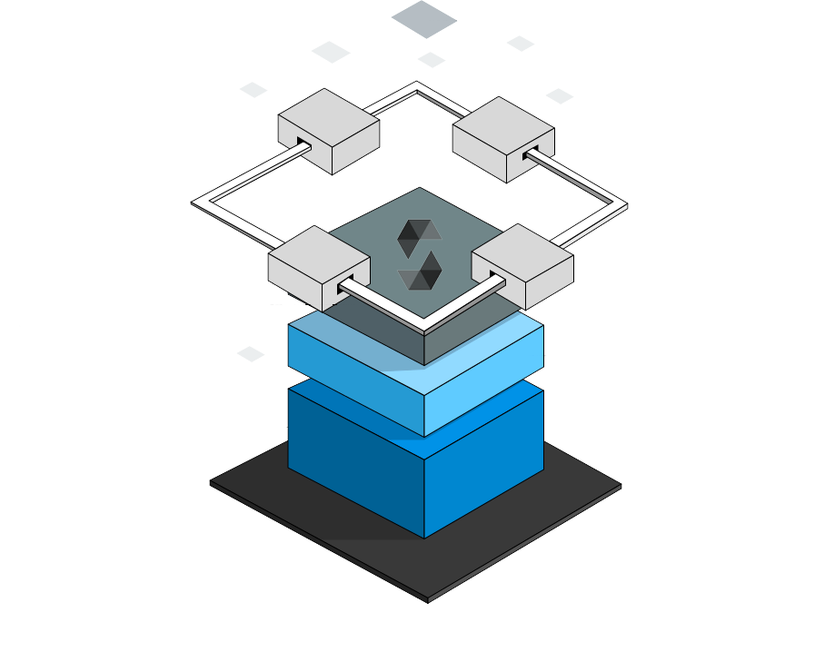

# Blockchain Voting App

A decentralized application for voting among members of a community.

## Dependencies

[NPM]

## Deployment

[Remix](https://remix.ethereum.org/)
[MetaMask](https://docs.metamask.io/)

## Codebase
[Solidity]

## Dev Tools

[Ganache](https://www.trufflesuite.com/ganache)

